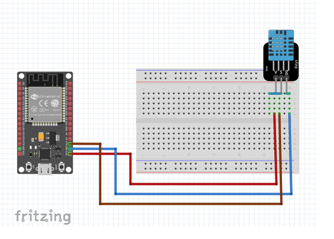
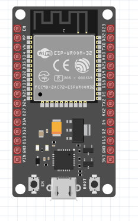
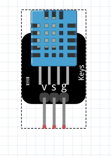
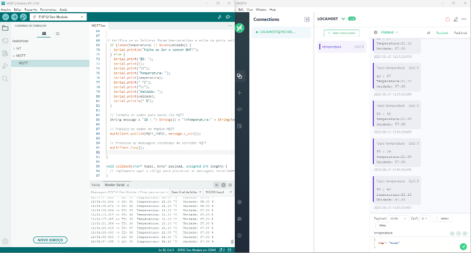

## Projeto IoT

A intenção deste projeto é demonstrar a potencilidade do arduino e sua versatilidade, utilizando a sua controladora para gerênciar e monitorar a temperatura e umidade do ar. 

A placa escolhida para desenvolver este projeto é a ESP32 ou Placa WiFi ESP8266 Node Mcu ESP-12.

O monitoramento será realizado atráves do protocolo MQTT, onde o dispositivo IoT/Estação Metereológica será o Publisher e o Subscriber será um dispositivo MQTT-Client instalado remotamente, como subscriber, sendo possível visualizar os dados enviados pelo dispositivo Iot.

### Lista de Materiais:
- ESP32
- DHT11 - Sensor de Temperatura e Umidade
- Protoboard

### Diagrama da Solução:

### Interfaces Utilizadas
####ESP32
ESP32 WROOM-32, fabricado pela ESPRESSIF, Unidade microcontroladora, responsável por coletar informações do sensor e publicá-las via MQTT.

####DHT11
Sensor responsável pela Temperatura e Umidade do Ar.
Este sensor oferece a leitura de temperatura e umidade, com precisão de +/-5% HR (Umidade Relativa) e de +/-2ºC para temperatura.
Os dados serão coletados a cada 2 segundos e enviados para o servidor MQTT.

### Softwares Utilizados
####Mosquitto Broker
O Mosquito Eclipse é um broker MQTT Open Source.

####MQTTX
O MQTTx é uma plataforma cliente para MQTT.
(https://mqttx.app/)
!

### Funcionamento da Solução
Estação Metereológica
Nossa estação metereológica será composta com sensores com capacidade de coletar dados de temperatura e humidade do ar.

Os dados gerados pelo sensor DHT11 serão enviados através do microcontrolador ESP32 via rede wireless para o broker MQTT a cada 4 segudos, que está instalado localmente no notebook.
O MQTT escolhido foi o Mosquitto e o cliente para assinatura o MQTTx

### Publicação e Assinatura

